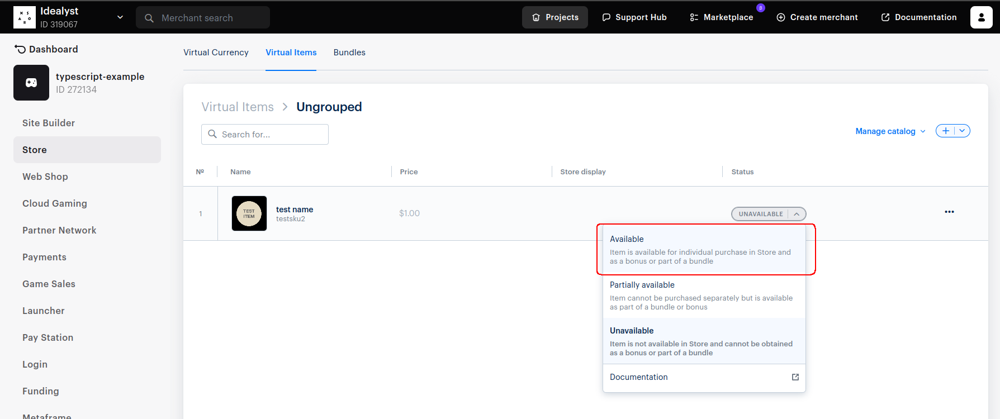

# Xsolla Client-Side Integration Example

This repository provides an example of how to integrate Xsolla PayStation and handle payment processing

## Setup Instructions
Video instruction - https://www.youtube.com/watch?v=7kjZN0239SE

### 1. Create and set up project in Publisher Account
See documentation https://developers.xsolla.com/solutions/payments/client-side-token-generation/create-and-set-up-pa-project/

### 2. Copy `.env.example` to `.env`
First, create a `.env` file from the provided `.env.example` template:

```bash
cp .env.example .env
```
Next, fill in the necessary values in the .env file

PROJECT_ID and LOGIN_PROJECT_ID can be found in your Xsolla Publisher Account.


### 3. Create and activate Item for selling





### 4. Install dependents 

```bash
yarn install
```

### 5. Run a project

```bash
yarn run dev
```

Open `http://localhost:5173/`


### 6. Make a test payment
